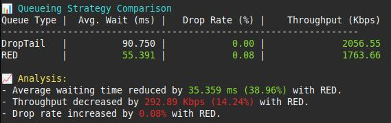
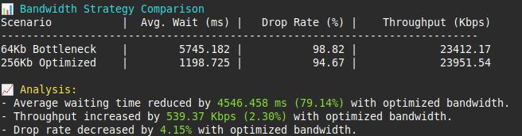
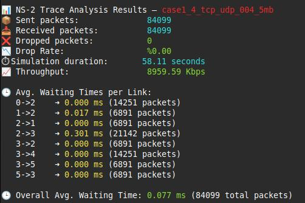
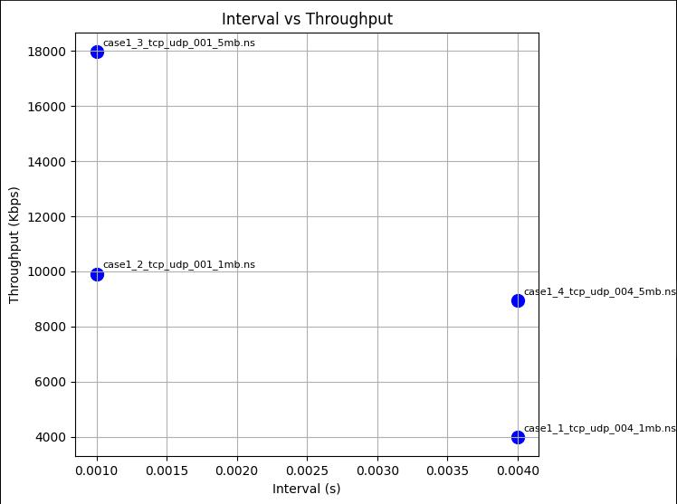

# NS-2 Network Simulation Project

This project involves the simulation of various network scenarios using the **NS-2** simulator. The main objective is to examine how changing network parameters (e.g., packet size, interval, queue type, bandwidth) affects key performance metrics such as **delay**, **throughput**, and **packet loss**.

The project was collaboratively developed by [@berkinyl](https://github.com/berkinyl), [@silanazaslan](https://github.com/silanazaslan), and [@erenyurtcu](https://github.com/erenyurtcu) as part of the **Simulation and Modelling** course at Manisa Celal Bayar University.

---

## 🖥️ Environment Setup

> ⚠ NS-2 is a legacy simulator developed in the early 2000s, which makes installation and compatibility a challenge on modern systems.

In this project, the team utilized a **Linux Mint** environment.

---

## 📁 Project Structure

```
├── case1/       # Interval and Bandwidth analysis (TCP + UDP)
├── case2/       # Packet size effect (UDP)
├── case3/       # Queue type comparison (DropTail vs RED)
├── case4/       # Bottleneck link (output bandwidth) variation
├── analyze_trace.py   # General trace analyzer
└── venv/        # Python virtual environment
```

Each `case` directory contains:
- `.ns` → NS-2 scenario (topology and traffic)
- `.trace` → Simulation logs (packet-level events)
- `.nam` → GUI animation file
- `caseX_analyzer.py` → Custom Python analyzer script

---

## 🔬 Metrics Analyzed

Using Python scripts, the following metrics were extracted:

- 📦 Sent / Received / Dropped packets
- 📉 Drop Rate (%)
- 🕒 Average Waiting Time (overall & per-link)
- 📈 Throughput (Kbps)
- ⏱️ Simulation Duration

---

## 📊 Case Summaries

### ➤ Case 1: Interval & Bandwidth
- Lower interval → higher traffic → more congestion
- Higher bandwidth → better throughput & lower drops

### ➤ Case 2: UDP Packet Size
- Larger packets → fewer drops, higher throughput, but higher risk on loss
- Smaller packets → increased drop due to queuing

### ➤ Case 3: Queue Type (DropTail vs RED)
- **DropTail**: Drops when queue is full (simple, high burst loss)
- **RED**: Random early drops to trigger TCP congestion control

🔁 Trade-off: RED reduces delay but may decrease throughput.

### Case 3 Analysis Output


### ➤ Case 4: Bottleneck Bandwidth
- Narrow link (64Kb) → high drop & delay
- Wider link (256Kb) → more stable, higher throughput
  
### Case 4 Analysis Output


---

## 🧪 Validation & Verification

✔ **Verification**:  
Trace outputs were matched with Python script outputs.

✔ **Validation**:  
Observed behaviors aligned with expected network theory:
- Throughput rises with bandwidth
- Queue type affects delay vs throughput balance
- Packet size alters risk vs efficiency

---

## 🛠 How to Run

```bash
# Run a simulation
$ ns case1_1_tcp_udp_004_1mb.ns

# Analyze output
$ python case1_analyzer.py
```

> Make sure NS-2 is installed and sourced, and Python virtualenv is activated.

---

## Example Outputs

### Trace Analyzer Output


### Graphical Output (Interval vs Throughput)

